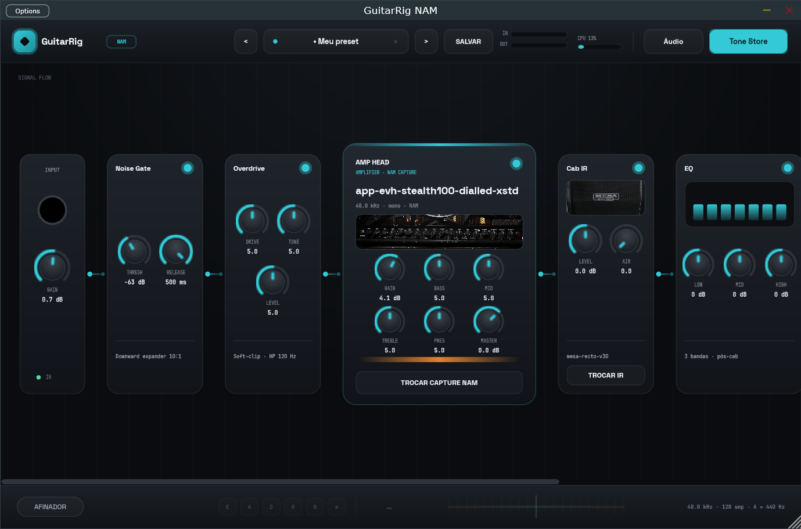
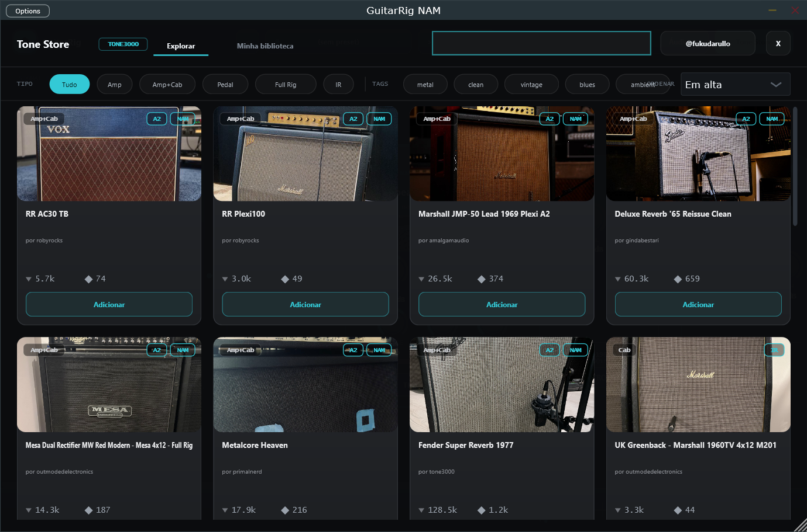
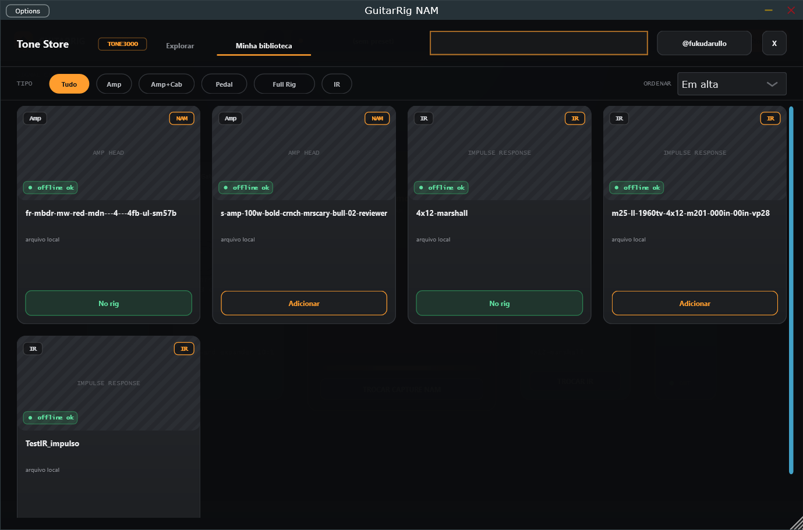
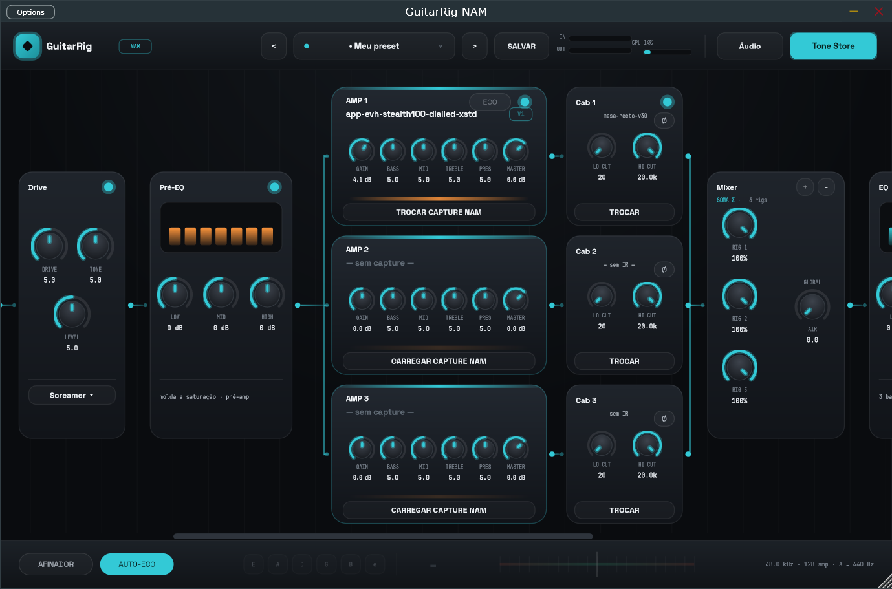
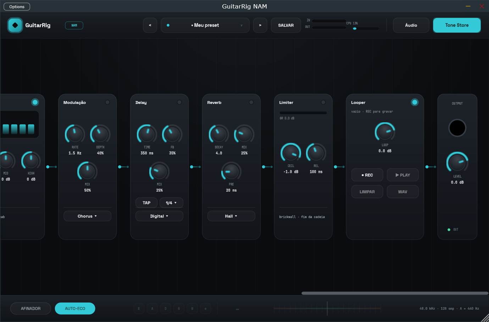
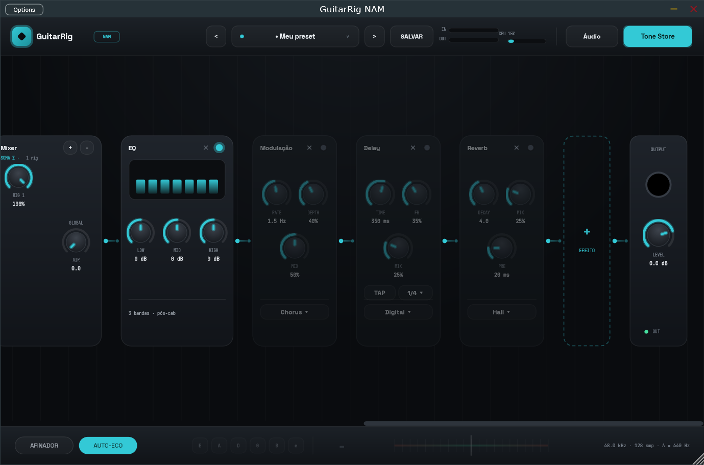
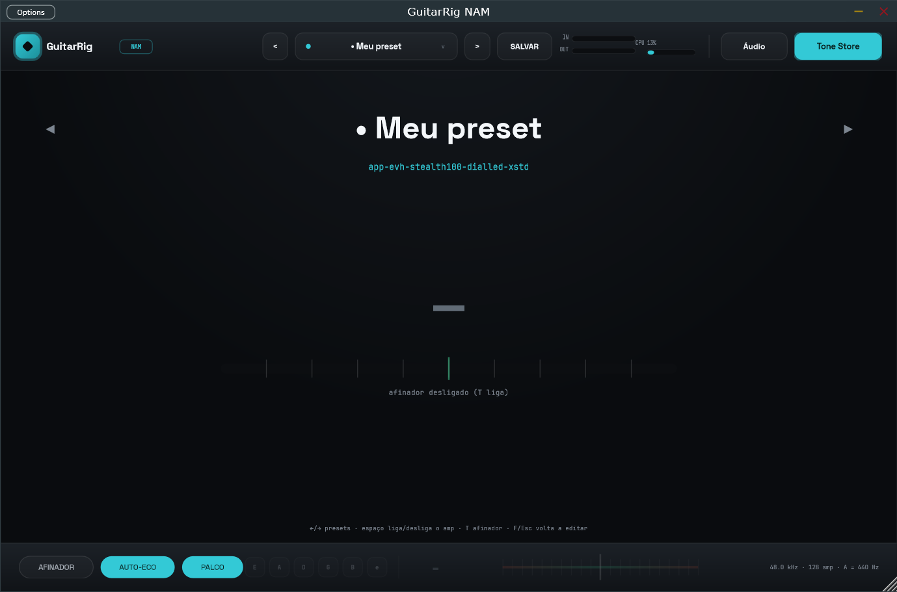

# 🎸 PedalForge NAM

**Amp sim pessoal para guitarra** — Standalone + VST3, baseado em [Neural Amp Modeler](https://github.com/sdatkinson/NeuralAmpModelerCore) (captures neurais de amplificadores reais) e JUCE 8, com loja integrada ao [TONE3000](https://www.tone3000.com).

  -33c9d6) 



---

## 📊 Estado do projeto

| Fase | Entrega | Status |
|------|---------|--------|
| 0 | Casco JUCE (Standalone + VST3), passthrough, ASIO | ✅ |
| 1 | NAM Core integrado ao build (WHOLE_ARCHIVE, C++20) | ✅ |
| 2 | Carregamento de captures `.nam` + DSP real, troca RT-safe | ✅ |
| 3 | Resampler automático (Lanczos), Noise Gate, Cab IR, presets | ✅ |
| 4 | Tone Store: OAuth PKCE + busca + downloads do TONE3000 | ✅ |
| 5 | Design v2, cadeia de pedais completa, afinador, fotos, UX | ✅ |

**Validação**: cada fase foi testada com guitarra real (Focusrite ASIO, 48 kHz, 128 samples) e testes headless do DSP (carregamento das arquiteturas A2/WaveNet/LSTM, resampling 48→44.1 kHz).

## ⚡ Funcionalidades

- **Cadeia de sinal estilo pedaleira**: mostra só os efeitos em uso; 23 efeitos disponíveis na gaveta **`+ EFEITO`** (por categoria), todos reordenáveis por drag-and-drop
- **Amp por capture neural**: qualquer `.nam` (arquiteturas A1/A2), com GAIN que satura o modelo como o amp real, tone stack B/M/T/Presence e Master
- **Resampler automático**: captures rodam no sample rate que esperam, em qualquer sample rate da interface (~0,6 ms de latência, reportada ao host)
- **Rigs paralelos**: até 3 pares **AMP+CAB** completos (capture + knobs próprios + IR por lane), sempre em dupla, somados no card **Mixer** (blend por rig + AIR global)
- **Cab IR** por convolução (wav/aiff/flac, troca sem glitch), low/high cut e fase por lane
- **Tone Store (TONE3000)**: login OAuth, busca com fotos, filtros por tipo/tags/arquitetura A2, escolha de variação (mics/canais), downloads com progresso, biblioteca offline, sem re-downloads
- **Afinador** real (detecção de pitch NSDF) com liga/desliga
- **Presets**: salvar em 1 clique, "Salvar como", indicador de modificado (•), presets de fábrica, navegação ◂ ▸
- **Fotos** do amp/cabinete carregados nos cartões do rig
- **UX**: knobs com trava no default, duplo-clique reseta, roda ajusta, Ctrl = fino, valor digitável; tooltips em tudo; atalhos (espaço, T, ←/→, Esc); medidores IN/OUT + CPU real
- **Pitch/octaver, Looper (60 s, overdub, export WAV) e Limiter** com indicador de clip
- **Variações por efeito** (Drive ×8, Comp ×4, Delay ×5, Reverb ×5, Mod ×6, Pitch ×5) com inspiração clássica e fonte de estudo documentadas em **[docs/EFEITOS.md](docs/EFEITOS.md)**
- **Slot de plugin VST3 externo**: hospede qualquer efeito de terceiros na cadeia, com painel próprio, MIX e estado salvo nos presets
- **Real-time safety**: zero alocação/locks/IO no caminho de áudio (regra inegociável do projeto)

## 🖼️ Telas

| Tone Store | Biblioteca offline |
|---|---|
|  |  |

## 🔧 Build (Windows)

Requisitos: VS 2022 (Build Tools ou Community) com C++, CMake ≥ 3.22, Git.

```powershell
git clone <url-do-repo> GuitarRigNAM
cd GuitarRigNAM
# só o necessário para o build (references/ é opcional e pesado):
git submodule update --init --recursive third_party

cmake -B build -G "Visual Studio 17 2022" -A x64
cmake --build build --config Release
```

Artefatos em `build\GuitarRigNAM_artefacts\Release\` (`Standalone\PedalForge NAM.exe` e `VST3\PedalForge NAM.vst3`).

### ASIO (recomendado)

O SDK da Steinberg não pode ser redistribuído. Baixe em <https://www.steinberg.net/asiosdk>, extraia para `third_party/asiosdk/` (deve existir `common/iasiodrv.h`) e reconfigure com:

```powershell
cmake -B build -G "Visual Studio 17 2022" -A x64 -DASIOSDK_DIR="$PWD\third_party\asiosdk"
```

`third_party/asiosdk/` está no `.gitignore` e **nunca** entra no Git.

## 🔑 Configuração do TONE3000

A API exige uma chave própria (grátis):

1. Crie conta em [tone3000.com](https://www.tone3000.com) → Settings → API Keys
2. Registre o redirect `http://localhost:53682/callback`
3. Cole a chave (`t3k_pub_…`) em `Documentos\PedalForge NAM\tone3000.json` (o app cria o template)
4. No app: Tone Store → **Conectar TONE3000**

> ⚠️ **Segurança**: `tone3000.json` guarda sua chave e o refresh token da sua conta. Ele vive em `Documentos\PedalForge NAM\` — **fora deste repositório** — e nunca deve ser commitado em lugar nenhum.

## 📁 Estrutura

```
src/                  código do plugin (processor, editor, store, cliente TONE3000)
docs/EFEITOS.md       fontes/referências de cada efeito e variação
assets/fonts/         Space Grotesk + JetBrains Mono (OFL, embutidas no binário)
docs/screenshots/     telas do projeto
references/           submódulos OPCIONAIS: projetos de referência p/ efeitos (ver references/README.md)
third_party/JUCE            submódulo pinado em 8.0.15 (necessário p/ build)
third_party/NeuralAmpModelerCore  submódulo pinado em v0.5.4, suporte A2 (necessário p/ build)
```

Dados do usuário (fora do repo): `Documentos\PedalForge NAM\` — `Captures/`, `IRs/`, `Presets/`, `tone3000.json`.

## 🗺️ Roadmap

**Fase 6 — concluída:**
- [x] Cabs paralelos: 1–3 slots de IR com blend, low/high cut e phase por cab + AIR global *(evoluiu para rigs AMP+CAB na fase 8)*
- [x] Cadeia reordenável por **drag-and-drop** (arraste os cartões de efeito; amp+cabs são âncora fixa)
- [x] Modo **ECO** (capture leve baixado junto) com **auto-ECO** em CPU > 90% + aviso ⚠ no medidor
- [x] Badges **V1/V2** da arquitetura em amps e IRs
- [x] Efeitos P1: compressor de pedal (presets Clean/Country/Lead), gate com hold+histerese de 6 dB, pré-EQ antes do NAM

**Fase 7 — efeitos P2 (concluída):**
- [x] Variações por efeito no cartão: Drive ×6 (Boost/Screamer/Blues/Distortion/Fuzz/Heavy), Comp ×3, Delay ×4, Reverb ×4
- [x] Delay: **TAP tempo** com subdivisões (1/4, 1/8, 1/8., 1/16), **Ping-Pong** estéreo e **trails**
- [x] Reverbs Hall/Room/Plate/**Spring**, estéreo real e trails
- [x] Cartão **Modulação**: Chorus, Phaser, Flanger e Tremolo harmônico

**Fase 8 — rigs paralelos AMP+CAB (concluída):**
- [x] Arquitetura corrigida: cada lane paralela é um par **AMP+CAB** completo (capture NAM com knobs próprios + IR), não só IRs em paralelo
- [x] Card **Mixer** dedicado: soma das lanes com blend por rig, AIR global e botões +/− que adicionam/removem o par inteiro (mín. 1, máx. 3)
- [x] Visual em paralelo de verdade: lanes **empilhadas** com bus de divisão na entrada e bus de soma no Mixer (com 1 rig, mantém o card grande clássico)



**Fase 9 — efeitos P3 (concluída):**
- [x] Cartão **Pitch**: octaver granular de 2 cabeças (Oitava ↓/↑, Quinta, Detune) com MIX/LEVEL — validado headless (440 Hz → 220/660/880 Hz)
- [x] Cartão **Looper**: até 60 s, REC → fecha e toca → overdub, PLAY/STOP, LIMPAR e **export WAV** (`Documentos\PedalForge NAM\Loops`)
- [x] Cartão **Limiter** brickwall no fim da cadeia com barra de gain reduction + aviso **CLIP** no medidor OUT



**Fase 10 — variações extra + referências documentadas (concluída):**
- [x] **[docs/EFEITOS.md](docs/EFEITOS.md)**: cada efeito e variação com a inspiração clássica, o projeto de referência estudado (`references/`) e a base da implementação; tooltips dos seletores citam as fontes
- [x] Novas variações vindas da lista de referências: Drive **Valve** (Airwindows Tube, MIT) e **Metal** (Guitarix) · Comp **Squeezer** · Delay **Ducking** · Reverb **Shimmer** (oitava acima no wet) · Mod **Vibrato** e **Rotary** (Leslie) · Pitch **Quarta**
- [x] Correção: Boost e Heavy Fuzz do Drive tinham menu mas caíam no som do Screamer — agora têm vozeamento e clip próprios

**Fase 11 — slot de plugin VST3 externo (concluída):**
- [x] Cartão **Plugin VST3** na cadeia: hospeda qualquer efeito VST3 do disco (Dragonfly, LSP, Airwindows, BIAS FX…) via hosting JUCE
- [x] Botões CARREGAR/TROCAR, **PAINEL** (interface do plugin em janela própria) e REMOVER + knob MIX (dry/wet) + LED de bypass
- [x] Troca de instância RT-safe (mesmo protocolo pending/retired dos modelos NAM); mono → estéreo para o hóspede com retorno estéreo via `stereoExtra`
- [x] Caminho **e estado interno** do plugin salvos nos presets (base64), com restauração automática
- [x] Testado com BIAS FX 2 (processamento + painel)

**Fase 12 — cards P4: 10 efeitos novos, um card por efeito (concluída):**
- [x] **Wah** (Auto/Manual/LFO) · **Slow Gear** (swell) · **Octaver** analógico · **Ring Mod** · **Bitcrusher** — lado pré-amp
- [x] **Harmonizer diatônico**: detecta a nota tocada (autocorrelação) e canta a 3ª/5ª/6ª/oitava DENTRO do tom/escala escolhidos
- [x] **Exciter** · **De-esser** · **Tape** (Airwindows ToTape, MIT) · **Console** glue (Airwindows Console, MIT) — lado pós-amp
- [x] Cada efeito tem card próprio com controles dedicados (total: 23 cards na cadeia, todos reordenáveis)
- [x] Slot VST3: botão CARREGAR virou menu com os plugins instalados no sistema + tabela de grátis recomendados em docs/EFEITOS.md

**Fase 13 — UX: gaveta de efeitos + navegação (concluída):**
- [x] A cadeia mostra **só os efeitos em uso**; **`+` em cada conector** adiciona um efeito naquela posição exata, e o botão tracejado **`+ EFEITO`** no fim insere na posição musicalmente certa — ambos abrem a gaveta por categorias (Dinâmica · Drive & Filtro · Pitch · Modulação & Cor · Ambiência · Extras)
- [x] **✕** em cada card devolve o efeito pra gaveta (ajustes preservados); presets salvam a pedaleira montada
- [x] Cards **desligados ficam esmaecidos** — o olho acha na hora o que está soando
- [x] **Roda do mouse rola a cadeia** e **arrastar o fundo faz pan** (mãozinha), como numa DAW



**Fase 14 — modo palco (concluída):**
- [x] Chip **PALCO** (ou tecla **F**): esconde a cadeia e mostra o essencial gigante — nome do preset (com indicador de modificado), capture carregado, **afinador grande** (nota + régua de cents, verde quando afinado) e dicas de atalhos
- [x] No palco o afinador funciona mesmo com o chip AFINADOR desligado; clique nas laterais navega presets, no centro abre o menu; **Esc/F** volta a editar



**Fase 15 — roadmap fechado (concluída):**
- [x] **Analisador de espectro**: card com FFT 2048 ao vivo (24 bandas log, 40 Hz–16 kHz)
- [x] **Medidores com peak-hold** + microinterações (hover nos `+`/`✕`, cursor de mãozinha)
- [x] **Drag-and-drop de arquivos**: arraste `.nam` no amp, IR no cab e `.vst3` no slot externo (com realce do alvo)
- [x] **Afinador com MUTE** (silencia a saída enquanto afina) · delay/reverb estéreo (desde a fase 7)
- [x] **Favoritos ★ no TONE3000** (persistidos + filtro "Só ★") · **A/B de rigs** (compara dois ajustes completos) · **Gravador rápido** (WAV 24-bit da saída em `Documentos\PedalForge NAM\Gravações`)
- [x] Correções de UX: relayout imediato ao remover/adicionar cards (sem alvos defasados sob o mouse), relayout adiado durante arrasto de knob

**Fases 16–17 — plugins VST3 externos (concluídas):**
- [x] **Até 8 slots** de plugin VST3 na cadeia (na prática o limite é a CPU); menu CARREGAR por categoria
- [x] Catálogo **embutido** com 8 plugins open source (Dragonfly, Airwindows, Zam, AIDA-X, Fire, Wolf Shaper, PeakEater, Surge XT Effects): aba **Plugins** no Tone Store com toggle INSTALAR ⇄ DESINSTALAR, progresso e versões pinadas — **só download direto**: instala extraindo o .vst3 na pasta do usuário (sem admin) e desinstala apagando o arquivo, sem instalador
- [x] `plugins/` no repo: script alternativo + cópia offline (32 MB) com licenças
- [x] **Renomeado para PedalForge NAM** (evita confusão com o Guitar Rig da NI); dados antigos migram sozinhos

**Fase 18 — módulo Bateria (em andamento):**
- [x] Motor: sequencer sample-accurate no processBlock (2 compassos × 16 steps, 9 vozes, acento/ghost), swing, clique, contagem; barramento próprio somado no master (não passa pela cadeia da guitarra)
- [x] Fontes de som: **sampler interno sintetizado** (funciona de fábrica) e **VST3 de bateria hospedado** (MIDI GM canal 10, protocolo pending/retired, painel em janela própria)
- [x] UI v4 "a pauta é a track" (botão **Bateria** na top bar): a área central mostra a **seção inteira (4 compassos) em pentagrama corrido**; grooves de **1 compasso** são **arrastados da biblioteca direto para o compasso na pauta**; clique na pauta edita (vazio→toque→acento→ghost); seções em abas (**+ SEÇÃO** = +4 compassos); **SEGUIR** vira a página no play; chip **GRADE** abre a grade de 16 steps do compasso selecionado
- [x] **Biblioteca**: ~70 grooves + 24 viradas de fábrica em 14 gêneros (tudo 1 compasso, arrastável) + **Meus compassos** (salvar/apagar em `Documentos\PedalForge NAM\compassos`)
- [x] Timeline/BPM/swing/fonte salvos no preset (A/B incluso; formatos antigos migram)
- [ ] Pendentes: saída MIDI externa, mini-mixer por peça, copiar compasso→compasso arrastando
- Design aprovado: `docs/design/bateria-mockup.html`; dev flags `GUITARRIG_OPEN_DRUMS=1|play`

**Próximos:**
- [ ] Ideias futuras: minimapa da cadeia, MIDI learn, snapshot de cena por música

## 🤝 Contribuindo

Contribuições são bem-vindas! Leia o **[CONTRIBUTING.md](CONTRIBUTING.md)** (build, mapa do código, regras de real-time safety e armadilhas conhecidas do MSVC/JUCE) e use os templates de issue/PR. Itens não marcados do roadmap são um ótimo ponto de partida.

*Contributions welcome — see [CONTRIBUTING.md](CONTRIBUTING.md) (Portuguese; feel free to open issues in English).*

## 📜 Licenças

Este projeto é licenciado sob a **[AGPLv3](LICENSE)** — exigência do uso do JUCE 8 no tier open source. Dependências:

- **JUCE 8** — AGPLv3 (uso pessoal/open-source) · **NAM Core** — MIT · **AudioDSPTools** — Apache-2.0/MIT (ver repositório)
- **Fontes** — SIL Open Font License (textos em `assets/fonts/`)
- **ASIO SDK** — licença Steinberg (download manual, não redistribuído)
- Captures/IRs baixados do TONE3000 têm licenças próprias por tone (CC/T3K) — respeite-as ao redistribuir timbres.
