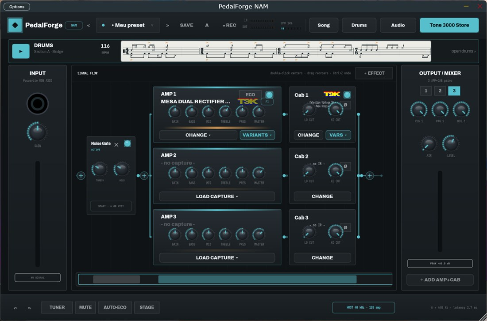
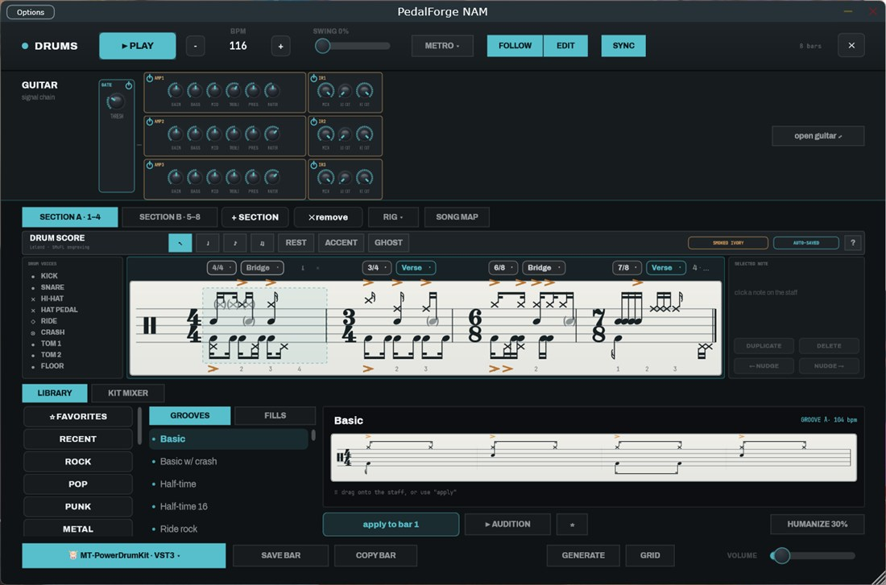
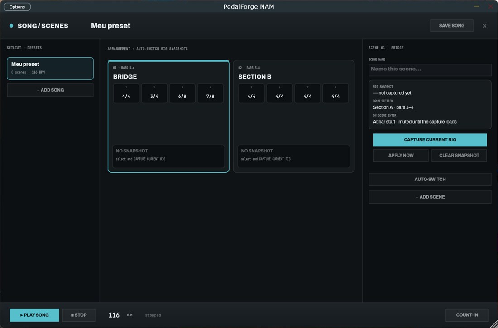
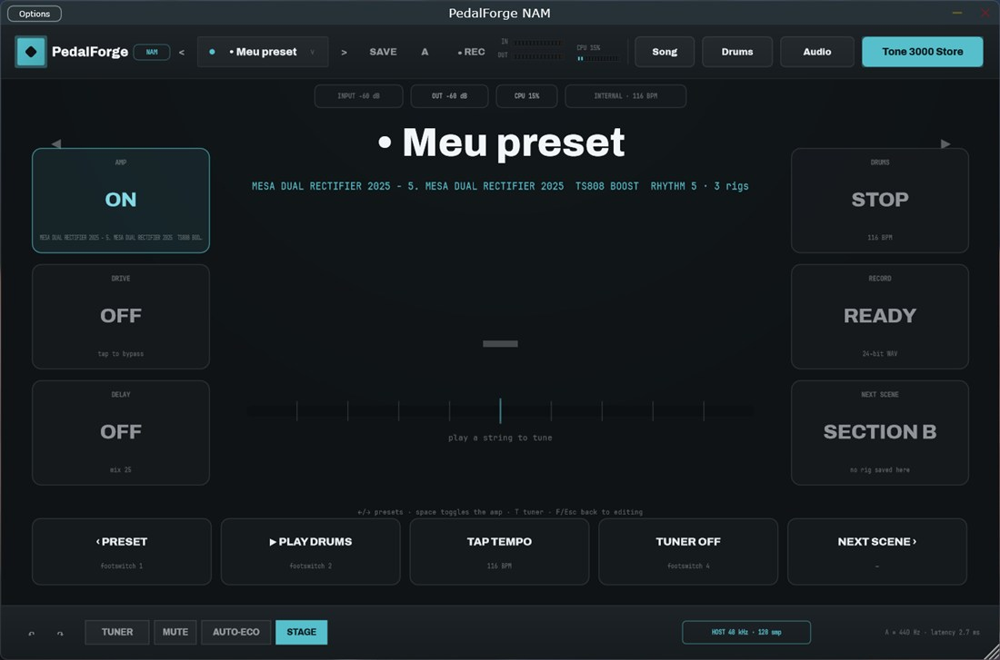
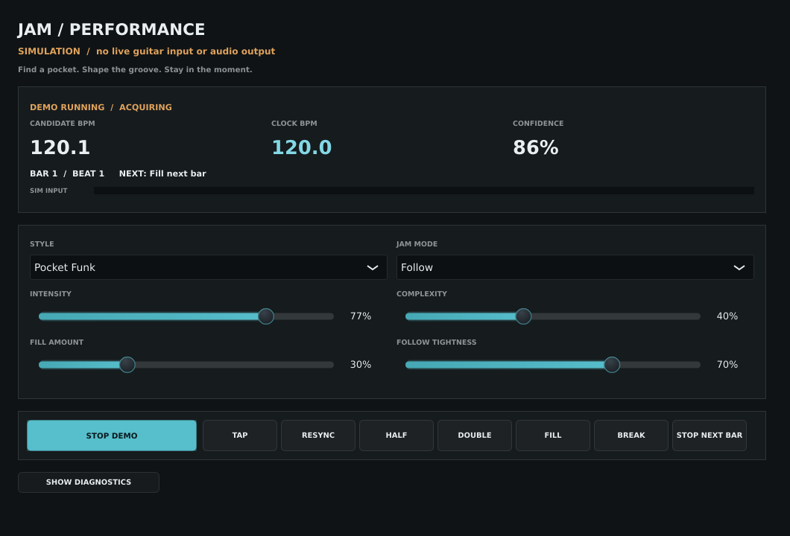

# JamMate

### Your guitar. A steady pulse. Room to play.

An open-source, offline-first guitar practice and creative-jamming app—building
toward a drummer that listens, joins your groove, and follows intentional tempo
changes while keeping your guitar monitoring responsive.

[](LICENSE)


**[Get started](#get-started)** · **[Build](#build-from-source)** ·
**[Development status](#development-status)** · **[Architecture](#architecture)** ·
**[Contribute](#contributing)**


*The inherited Guitar Companion interface. JamMate's adaptive-jam controls are in development.*

## Why JamMate?

Practising alone should still feel like playing with someone. A backing track
keeps going whether you pause, change your phrasing, or find a better tempo.
JamMate's goal is a musical partner: listen first, establish a pulse, hold a
stable groove, and leave space for the next idea.

The first focus is **guitar + adaptive drums**. Bass, keys and other accompaniment
are future work. Playing must work offline; cloud inference and accounts are not
part of the planned jam loop.

JamMate builds on [Raphael Fukuda's Guitar Companion](https://github.com/raphaelfukuda/Guitar-Companion),
preserving its amp, effects and drum foundation while developing a separately
testable rhythm-analysis and musical-clock layer.

## What you can do today

The existing application provides a substantial practice rig:

| Area | Available foundation |
|---|---|
| **Shape your sound** | Neural Amp Modeler captures, cabinet IRs and up to three parallel amp/cab rigs |
| **Build a pedalboard** | Reorderable effects, tuner, looper and hosted VST3 effect slots |
| **Play with drums** | Internal sampled kit, groove/fill library, editable drum notation, swing and humanization |
| **Arrange a session** | Song sections, per-section rig scenes and a dedicated stage view |
| **Keep the idea** | Presets and guitar/drum/mix recording |
| **Find tones** | Optional TONE3000 integration and a local capture/IR library |

**Automatic listen/join/follow is not connected to the live application yet.**
The current drums are sequenced accompaniment. The analysis worker and clock
foundation are tested, but production tracker selection, live transport wiring
and the adaptive-jam UI are still open.

<details>
<summary><strong>See the drum, song and stage screens</strong></summary>

### Drums


### Song and scenes


### Stage


These screenshots show the inherited interface, rather than the planned adaptive drummer.

</details>

### Jam screen prototype

The new [Jam UI shell](docs/research/JAM-UI-SHELL.md) has been compiled and
verified as a standalone preview. Its controls and telemetry use **simulated
data**, with no live guitar input or audio output; production wiring is pending.



## Get started

This is a **source-first development project**; no JamMate release binary is
published yet. Start with the [build instructions](#build-from-source), then:

1. Open **Audio & MIDI**, select your interface, input/output, sample rate and
   buffer size, and choose **APPLY CHANGES**. Check that the input meter moves.
2. On **Rig**, load a local `.nam` capture and a cabinet IR. The optional Tone
   Store can help find captures; it is not required to use local files.
3. Set input level, amp gain and master level. Add effects through **+ EFFECT**.
4. Open **Drums**, choose a groove and set the tempo. Start the sequencer to play
   against the existing drum engine.
5. Save the rig as a preset, or record a take when an idea lands.

The current executable, plugin bundle and user-data folder retain the name
**Guitar Companion**. Existing presets and application identifiers are preserved.

For the six screens, controls, tone-store setup and data locations, see the
**[user guide](docs/USER-GUIDE.md)**.

## Development status

**Windows and Linux builds verified; bounded Linux runtime probes verified.**
ASIO, physical-device timing and hosted-plugin coverage still need verification
for this fork. macOS has not been verified.

| Milestone | State |
|---|---|
| Application foundation | Windows/Linux Standalone and VST3 build; inherited rig/drums available |
| Real-time stabilization | Bounded callback probes, MIDI reservation and editor-absent scene delivery verified; full coverage remains partial |
| NAM LSTM repair | Measured per-sample allocations removed; tested numerical outputs byte-identical |
| Analysis-worker foundation | Injected tracker, lifecycle, discontinuities and bounded evidence queue implemented and tested |
| Rhythm diagnostics | Portable snapshots and bounded trace export tested; live wiring and callback-overhead measurement pending |
| Musical Clock | Deterministic core implemented; live end-to-end evidence pending |
| Jam UI shell | Simulated standalone preview built and resize/control checks pass; application wiring pending |
| Tracker selection | BTrack and aubio evaluated; acquisition gate still unmet; no production backend selected |
| Adaptive drummer | Live auto-join/follow, dynamics, fills and production Jam controls pending |

### Verification

Latest local verification, **8 October 2026**:

- **21/21** core suites with both optional trackers enabled; **19/19** with them
  disabled. The core builds without JUCE or an audio device.
- **6/6** JUCE drum suites pass, including 12 new foundation regressions;
  **Standalone + VST3** builds succeed on Linux and Windows.
- [GitHub verification](https://github.com/mojomast/jammate/actions/runs/37720364067)
  passes the four core configurations, NAM repair checks, and Windows build/tests.
- **26** real-processor probe cases show zero detected heap allocation/free or
  lock/wait operations after the scoped LSTM repair, including eight NAM cases.
  These probes cover a bounded matrix, not every model, effect, host or device.
- [Broader NAM architecture probes](docs/research/NAM-ARCHITECTURE-PROBE.md)
  independently reproduce five model types. Four are clean within the repaired
  archive's measured cases; `wavenet_a2_max.nam` still allocates in its activation
  paths. This finding remains open.
- **29 analyzer tests / 1,210 checks** pass, including a limited synthetic
  ThreadSanitizer run with no reported races.
- **34 diagnostics cases** pass, covering ordered traces, drop accounting,
  lossless timestamps, missing measurements and CSV/JSON export. Scoped sanitizer
  checks pass within the [integration receipt](docs/research/jam-diagnostics-integration.json)'s
  stated limits; production integration remains pending.
- A diagnostic-only BTrack tempo-report variant improves some steady-material
  BPM errors, but fails the acquisition gate. [Paired robustness measurements](docs/research/TEMPO-VARIANT-ROBUSTNESS.md)
  retain significant gap/noise regressions and six lost per-clip acquisitions.
  It is not the default backend.

The [execution ledger](EXECUTION-LEDGER.md) is the authoritative status record.
Reproduction commands, hashes and limitations live in the linked research
reports, including the [processor probe](docs/research/PROCESSOR-RUNTIME-PROBE.md),
[LSTM repair](docs/research/NAM-LSTM-RT-REPAIR.md),
[analysis worker](docs/research/ANALYSIS-WORKER.md) and
[tempo variant](docs/research/TEMPO-REPORT-VARIANT.md).

## Build from source

### 1. Clone

```sh
git clone https://github.com/mojomast/jammate.git
cd jammate
```

### 2. Run the portable core first

Requirements: a C++17 compiler, CMake, Ninja and Python 3.10+ for the research
checks. **No submodule initialization, JUCE, audio SDK or hardware is needed.**

```sh
cmake -S jam-core -B build/core -G Ninja -DCMAKE_BUILD_TYPE=Release
cmake --build build/core --parallel 2
ctest --test-dir build/core --output-on-failure
```

BTrack and aubio are optional, vendored evaluation targets. To include their
backend tests, configure a separate core build with:

```sh
cmake -S jam-core -B build/core-trackers -G Ninja \
  -DCMAKE_BUILD_TYPE=Release -DJAM_ENABLE_BTRACK=ON -DJAM_ENABLE_AUBIO=ON
cmake --build build/core-trackers --parallel 2
ctest --test-dir build/core-trackers --output-on-failure
```

Those flags build evaluation adapters; they do not enable automatic following
in the application.

### 3. Build the application

Requirements: a C++20-capable toolchain, **CMake 3.24+** for whole-archive linkage,
and the platform development packages below. Fetch just the product submodules:

```sh
git submodule update --init third_party/JUCE
git -c core.autocrlf=false submodule update --init --recursive third_party/NeuralAmpModelerCore
```

`references/` contains optional study material and is not needed for a build.
NAM's nested Eigen and AudioDSPTools submodules **are** needed. The LSTM repair
is applied to a hash-verified generated copy in the build directory; its pinned
upstream checkout stays untouched.

#### Windows

Use Visual Studio 2022 with **Desktop development with C++**:

```powershell
cmake -S . -B build/windows -G "Visual Studio 17 2022" -A x64 `
  -DGUITAR_COMPANION_BUILD_TESTS=ON
cmake --build build/windows --config Release --target GuitarCompanion_Standalone GuitarCompanion_VST3 GuitarCompanionTests --parallel 2
ctest --test-dir build/windows -C Release -R '^drums\.' --output-on-failure
```

- **ASIO:** obtain the SDK from [Steinberg](https://www.steinberg.net/asiosdk)
  and configure with `-DASIOSDK_DIR="C:/path/to/asiosdk"`. The directory must
  contain `common/iasiodrv.h`. Without it, the Standalone uses WASAPI/DirectSound.
- **Embedded Tone Store:** Windows builds can fetch the pinned WebView2 SDK.
  Disable it with `-DGUITAR_COMPANION_EMBEDDED_BROWSER=OFF` for the system-browser
  flow. The embedded flow requires the WebView2 Runtime on the user's machine.

The Windows recipe has passed on GitHub's Windows2022/MSVC runner with ASIO and
the embedded browser disabled. Physical-device execution remains open.
The current build artifacts keep the upstream names:

```text
build/windows/GuitarCompanion_artefacts/Release/
  Standalone/Guitar Companion.exe
  VST3/Guitar Companion.vst3/
```

#### Linux

Install the JUCE audio, font and X11 development dependencies. On Debian/Ubuntu
with a sufficiently recent CMake:

```sh
sudo apt-get install build-essential cmake ninja-build pkg-config python3 \
  libasound2-dev libfontconfig1-dev libfreetype6-dev libx11-dev libxext-dev \
  libxcomposite-dev libxcursor-dev libxinerama-dev libxrandr-dev libxrender-dev \
  libbz2-dev libpng-dev libbrotli-dev

cmake -S . -B build/linux -G Ninja -DCMAKE_BUILD_TYPE=Release \
  -DGUITAR_COMPANION_BUILD_TESTS=ON -DGUITAR_COMPANION_EMBEDDED_BROWSER=OFF
cmake --build build/linux --target GuitarCompanion_Standalone GuitarCompanion_VST3 GuitarCompanionTests --parallel 2
ctest --test-dir build/linux -R '^drums\.' --output-on-failure
```

Outputs are under `build/linux/GuitarCompanion_artefacts/Release/`.
The [verified local Linux recipe](docs/research/LOCAL-LINUX-BUILD.md) also
documents building with an extracted dependency prefix when root access is
unavailable. Linux device latency has not been measured by these builds.

## Architecture

The tracker supplies evidence. **The Musical Clock decides the pulse.** The
drummer follows that clock, rather than chasing each new BPM estimate.

```text
Guitar input ──► existing guitar DSP / NAM / cabinet ──► monitored output
     │
     └─► bounded audio ring ─► analysis worker ─► rhythm observations
                                                      │
                                                      ▼
                                                Musical Clock
                                                      │
                                                      ▼
                                                clock snapshot
                                                      │
                                                      ▼
                                               Jam Director
                                                      │
                                                      ▼
                                          drum transport / engine ─► drum bus
```

The diagram is the target live pipeline. The ring, worker, clock and transport
seams exist; processor wiring and the Jam Director are still being built.

Design rules:

- **Guitar monitoring wins every deadline.** Analysis may drop data; the callback
  never waits for it.
- **Callback work is bounded.** No allocation/free, blocking, I/O, logging or
  message posting in the audio callback. This is a measured engineering contract,
  not a blanket safety claim about all inherited or hosted DSP.
- **Beat events are not coalesced away.** Bounded queues retain ordered evidence
  and count incoming drops explicitly.
- **Keep time semantics honest.** An event timestamp, an input horizon and live
  evidence availability are distinct; worker backlog must not masquerade as
  zero-latency evidence.
- **Changes happen musically.** Stable tempo, beat/bar boundaries and inexpensive
  manual correction take priority over reacting to every strum.

## Find your way around

| Path | Purpose |
|---|---|
| [`src/`](src/) | Existing JUCE application, guitar DSP and drum engine |
| [`src/jam/`](src/jam/) | Portable rhythm types, worker, clock and transport seams |
| [`src/rt/`](src/rt/) | Bounded signalling and queue primitives |
| [`jam-core/`](jam-core/) | JUCE-free build and core test registration |
| [`tests/`](tests/README.md) | Application and core tests |
| [`tools/`](tools/) | Offline evaluation, causal diagnostics and runtime probes |
| [`testdata/rhythm/`](testdata/rhythm/) | Versioned synthetic audio, references and manifests |
| [`docs/research/`](docs/research/) | Executed measurements, artifacts and reproduction notes |
| [`docs/adr/`](docs/adr/) | Architecture decisions |

**Start here:** [Product specification](SPEC.md) · [Development plan](DEVPLAN.md) ·
[Execution ledger](EXECUTION-LEDGER.md) · [Contributor guide](CONTRIBUTING.md).

## Contributing

Useful contributions include real-guitar tracker evidence, Windows/ASIO
verification, bounded callback repairs and the small live guitar-to-drums
integration. Read [CONTRIBUTING.md](CONTRIBUTING.md), then check the
[development plan](DEVPLAN.md) for task ownership and acceptance criteria.

For a bug, [open an issue](https://github.com/mojomast/jammate/issues) with your
OS, audio interface/driver, sample rate and buffer size, reproduction steps, and
what you expected versus what happened. For rhythm changes, include the input
fixture or recording's provenance and report both gains and regressions.

## License and credits

JamMate is **[AGPLv3](LICENSE)**. It derives from
[Guitar Companion](https://github.com/raphaelfukuda/Guitar-Companion) by
**Raphael Fukuda**, with the upstream history retained and the foundation pinned
at [`88f7e7c`](https://github.com/raphaelfukuda/Guitar-Companion/tree/88f7e7c805c9c5e17388154a678c2c6a3633ff23).

The project depends on work by the **JUCE contributors**, **Steven Atkinson**
(Neural Amp Modeler and AudioDSPTools), the **Eigen contributors** and
**Niels Lohmann**. Drum content, fonts, ported effects and optional tracker
backends have their own attribution and license terms. TONE3000 is an optional
external service; JamMate is not affiliated with it, and downloaded tones/IRs
retain their own licenses.

Read [THIRD_PARTY.md](THIRD_PARTY.md) for notices,
[the dependency inventory](docs/research/DEPENDENCIES.md) for pinned provenance,
and [the effect-source map](docs/EFEITOS.md) for specific ports and references.
Attribution belongs beside the work it makes possible.
