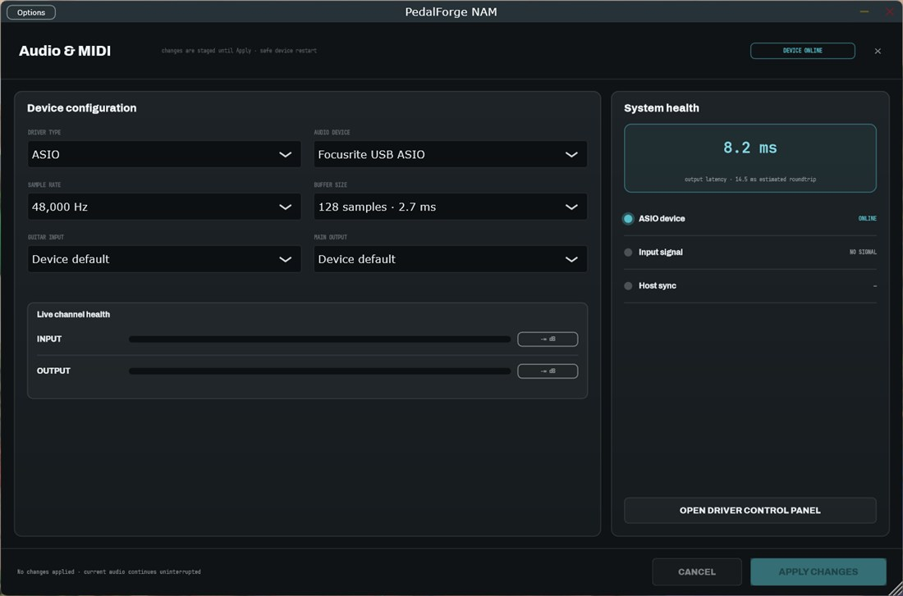
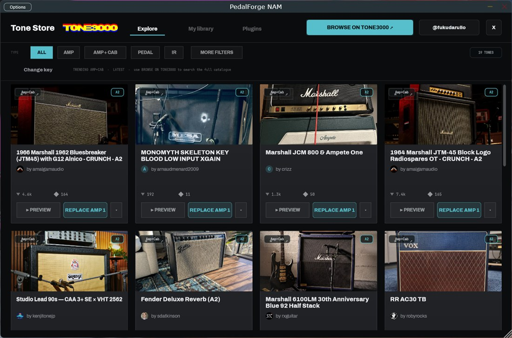

# JamMate user guide

JamMate currently uses the inherited **Guitar Companion** interface. This guide
covers the rig, sequenced drums and the first experimental live Jam workflow.
The wider adaptive controls described in [SPEC.md](../SPEC.md) remain in development.

Build the app using the [README](../README.md#build-from-source). The executable,
plugin bundle and user-data directory still use the name Guitar Companion.

## Your first session

1. Connect your guitar to your interface and open the Standalone application.
2. In **Audio & MIDI**, choose the driver, device, input/output, sample rate and
   buffer size. Choose **APPLY CHANGES**, then check the input meter while playing.
3. Open **Rig** and load a `.nam` capture and a cabinet impulse response. You can
   use local files or the optional Tone Store. With no capture/effects loaded,
   the chain passes the input through.
4. Adjust input level, the amp's **GAIN** and **MASTER**, and output level.
5. Open **Drums**, select a groove and tempo, then start playback.
6. Save a preset or record a take to keep the result.

The manual drum sequencer uses your chosen tempo. **Jam** offers a separate
experimental listening mode, described below.

## Jam: listen, join and follow

Open **JAM** from the main toolbar. In a default live-enabled build, the backend
is labelled **experimental BTrack**. It listens to guitar after input gain and
before the gate, effects and drum mix. The Musical Clock owns the tempo; the
first slice prepares one **4/4 Rock** groove and joins on a clock-aligned bar.

1. Choose a working input/output in **Audio & MIDI** and set guitar input level.
2. Open **JAM**, choose **START**, then play a steady, clearly accented rhythm.
3. Watch **LISTENING**, **WAITING FOR THE CLOCK** and **JOIN PENDING**. These are
   progress states. **PLAYING (AUDIO ECHO)** means the audio owner reports actual
   drum playback; an accepted Start alone does not mean drums have joined.
4. Use **Tap**, **Half/Double** and **Resync beat/bar** to correct tempo or phase.
   **Freeze/Resume** holds or resumes tracker-driven tempo changes.
5. Choose **STOP** to cancel a pending join and stop at the next audio block
   servicing the accepted command. **Stop next bar** defers active playback to
   the next bar. **Reset** stops and clears the clock belief.

Stopping releases live rendering ownership so the manual **Drums** and **Song**
transports can be used again without changing devices. Closing/reopening the
Jam screen preserves the session. Closing the editor does not stop the audio
pipeline; the reopened button follows live state.

Style, dynamics, complexity, fills and breaks are visibly disabled in the first
slice. A build without an available tracker reports **UNAVAILABLE** and does not
start Jam. Demo previews opt into simulation explicitly; their screenshots are
labelled **MOCK FIXTURE** and are not live-input measurements.

Tracker selection is still open: useful lock within two bars on representative
guitar material, physical interface latency and Windows/ASIO play tests remain
unverified. See the [live pipeline](research/LIVE-JAM-PIPELINE.md),
[Jam controls](research/LIVE-JAM-UI.md) and
[replay evidence](research/LIVE-JAM-REPLAY.md) for current results and scope.

## Rig: build the sound

The signal path reads left to right: input, the effects chain, amp/cab rigs and
output/mixer. The chain displays the effects you have added.

- **+ EFFECT** opens the effect drawer. Drag cards to reorder them; the **×**
  returns a card to the drawer while preserving its settings.
- **AMP HEAD** loads a neural capture. **CHANGE** selects another capture;
  **VARIANTS** selects available alternatives from the tone.
- **Cab IR** loads the cabinet response.
- **+ ADD AMP+CAB** adds another parallel rig, up to three complete amp/cab
  pairs. The **MIXER** sets each rig's blend and global AIR.
- A hosted **VST3** effect slot loads an installed third-party plugin. **PANEL**
  opens that plugin's editor; MIX controls its dry/wet contribution.

Knobs support wheel adjustment, double-click reset, fine adjustment with Ctrl
and typed values. Tooltips describe individual controls. The
[effect-source map](EFEITOS.md) documents the effects and their variations.

## Drums: choose and edit accompaniment

The drum screen brings together the transport, notation and groove/fill browser.

- Choose a genre and groove, or drag a library bar onto the score.
- Click notes to edit hits, accents and ghosts; **GRID** opens the selected bar's
  step grid.
- Set BPM, swing and humanization for the existing sequencer.
- Use **GENERATE** to create a bar from the genre/style/complexity controls.
- Add song sections through the section tabs. Bars can carry different meters.
- Use the built-in sampled kit or a hosted drum VST3 instrument.

The guitar and drum buses are separate: changing your guitar effects does not
run the drum kit through the amp chain.

## Song and scenes: one rig per section

A scene captures a guitar rig for a drum/song section. Capture the desired rig
for each section, then use **AUTO-SWITCH** for the existing section-boundary scene
workflow. A clean verse and a driven chorus can share one arrangement.

## Stage: focus on playing

The stage view prioritizes the preset name, tuner and large effect controls.
Press **F** to enter and **Esc** or **F** to return to editing. The tuner remains
available in stage view, and preset navigation is reachable from the main tile.

## Audio and MIDI: choose the device

Device changes are staged until **APPLY CHANGES**. The existing setup flow
attempts to restore the previous configuration if the new device fails to open.

Windows builds support WASAPI/DirectSound and optional ASIO when compiled with
the separately obtained SDK. Linux builds are verified at the build/test level;
this fork's physical-device latency and Windows/ASIO acceptance measurements
remain open in the [execution ledger](../EXECUTION-LEDGER.md).

## Optional TONE3000 setup

Local captures and IRs work without an account or network connection. To use the
Tone Store:

1. Create a [TONE3000](https://www.tone3000.com) account and obtain your own API key.
2. Register the redirect `http://localhost:53682/callback` for the API setup.
3. In **Tone Store**, paste the key, choose **Save key**, then **Connect TONE3000**.
4. Browse captures or IRs and load them into the appropriate rig lane.

The embedded Windows picker uses WebView2 when available. Builds without it use
the system browser and local callback flow. **FORMAT — NAM / IR** and
**ARCHITECTURE — A1 + CUSTOM / A2** scope the picker; **My library** shows locally
downloaded content for offline use.

The application ships no API key. Keys, refresh tokens and the browser profile
are local account data; keep them out of source control. TONE3000's service terms
and individual capture/IR licenses apply. JamMate is not affiliated with TONE3000.

## Presets, loops and recordings

Presets store your rig and the existing drum/session state. The modified marker
indicates unsaved edits; **Save as** creates another preset. The looper provides
record/play/overdub and WAV export; the recorder can keep the mix and separate
guitar/drum stems.

User data is stored under the system's **Documents/Guitar Companion/** folder:

| Directory/file | Contents |
|---|---|
| `Presets/` | Saved rigs and session presets |
| `Captures/`, `IRs/` | Local tone library |
| `Loops/`, `Recordings/` | Exported loops and recorded takes |
| `compassos/` | User drum bars |
| `tone3000.json` | Local Tone Store credentials |
| `webview/` | Embedded browser profile |

## Report a problem

[Open a JamMate issue](https://github.com/mojomast/jammate/issues) with:

- Your OS, interface/driver, sample rate and buffer size.
- The steps that reproduce the problem.
- The expected result and the actual result.
- Relevant logs or a reproducible preset/input, with its source and license.

For development and verification status, start at the
[README](../README.md#development-status) and [execution ledger](../EXECUTION-LEDGER.md).
